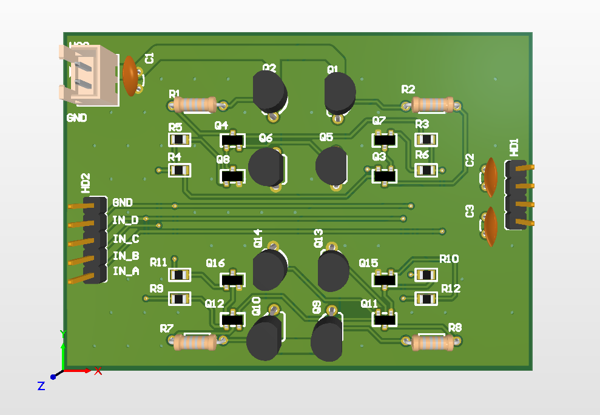
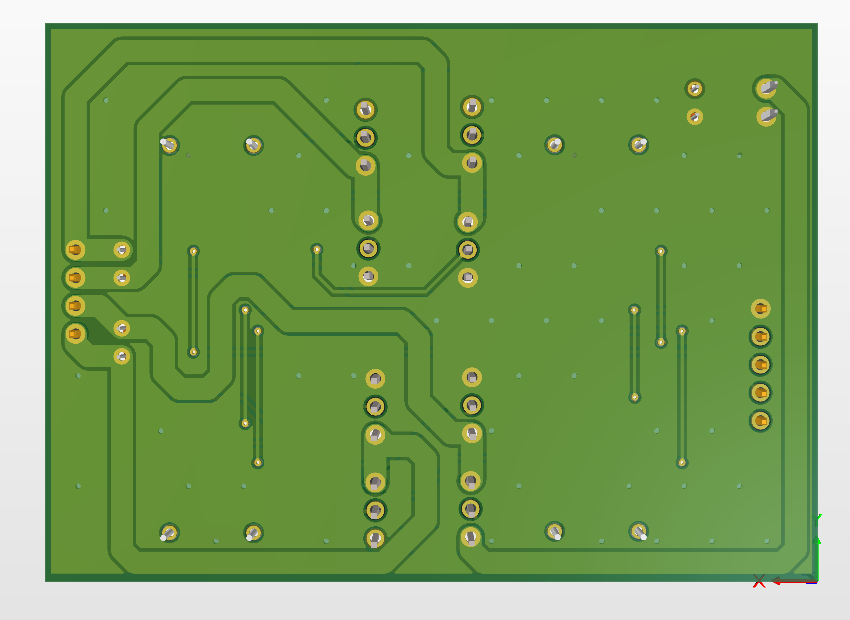
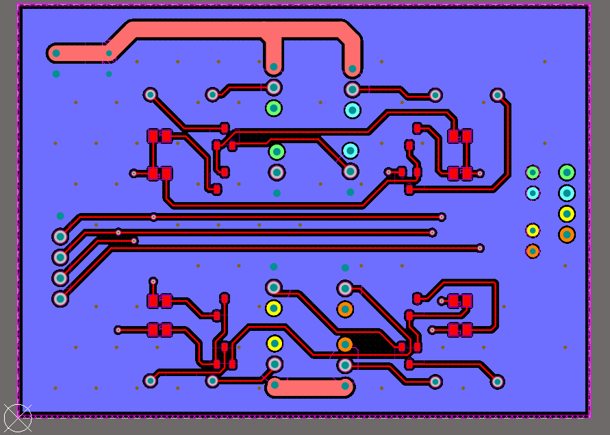
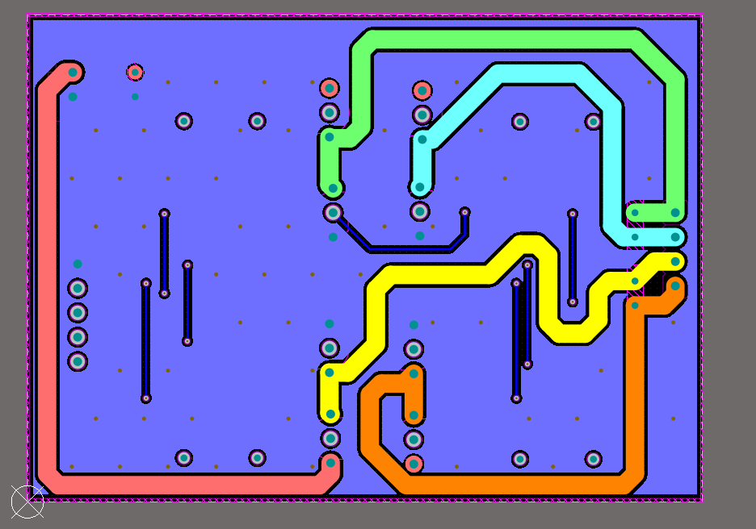
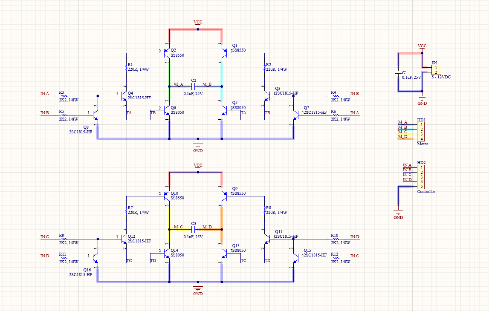

# H-Bridge Motor Driver PCB

**Description:** Designed a custom H-Bridge motor driver board with a focus on power electronics and safe high-current routing for DC motors.

**Key Hardware Responsibilities:**
* Designed hardware schematic and layout for a 2-layer H-Bridge motor driver board.
* Applied power electronics routing techniques, specifically calculating trace widths to safely handle high-current paths for continuous DC motor operations.

## Project Images

| View | Image |
| :--- | :--- |
| **Top View (3D)** |  |
| **Bottom View (3D)** |  |
| **Top Layer Layout** |  |
| **Bottom Layer Layout** |  |
| **Schematic** |  |
